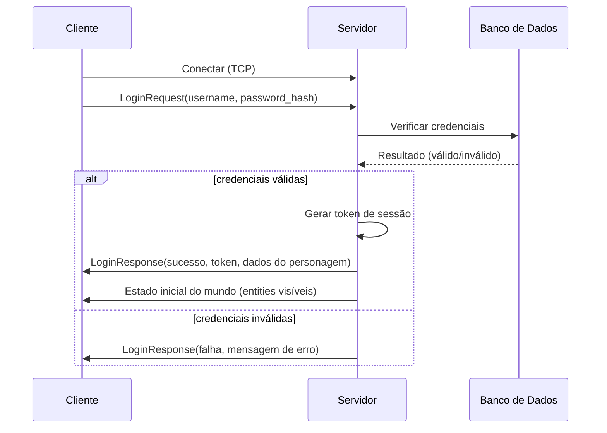
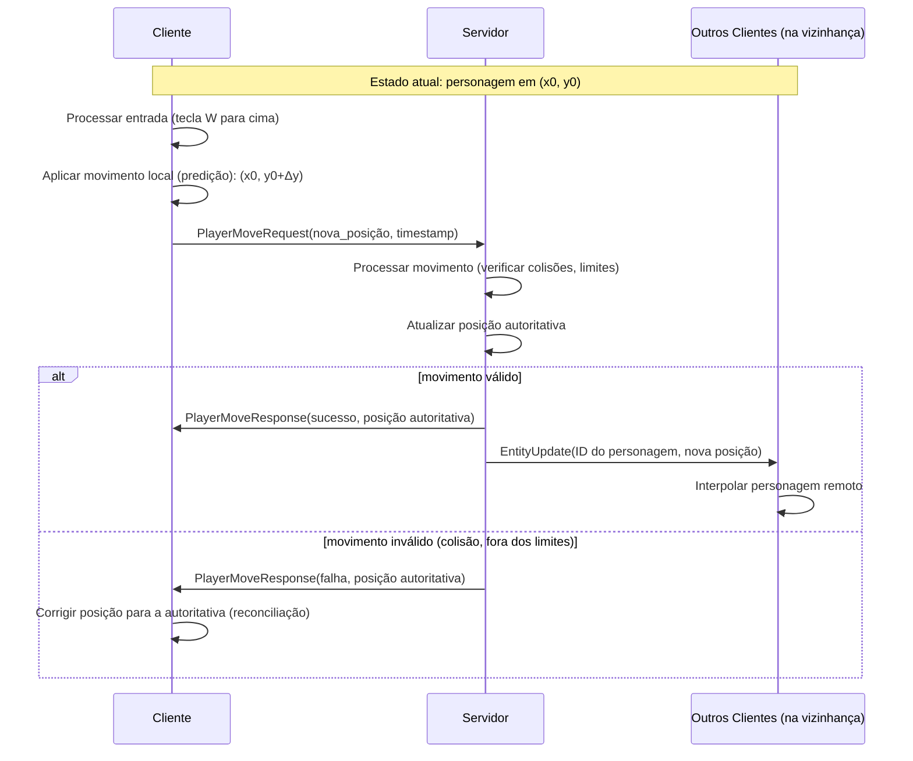

# 03: Definir arquitetura geral cliente-servidor e protocolos de rede

**What to build:** Arquitetura de alto nível desenhada em ARCHITECTURE.md: cliente Godot ↔ servidor C++ via TCP/WebSocket, mensagens protobuf ou JSON, autoridade do servidor, predição do cliente.

**Blocked by:** 01,02

**Status:** done

- [x] Acceptance criterion 1: Documento existe e descreve camadas (rede, lógica de jogo, persistência)
- [x] Acceptance criterion 2: Diagramas de sequência para login e movimento básico estão presentes

## Diagrama de Sequência: Login

## Diagrama de Sequência: Movimento Básico (com predição)

